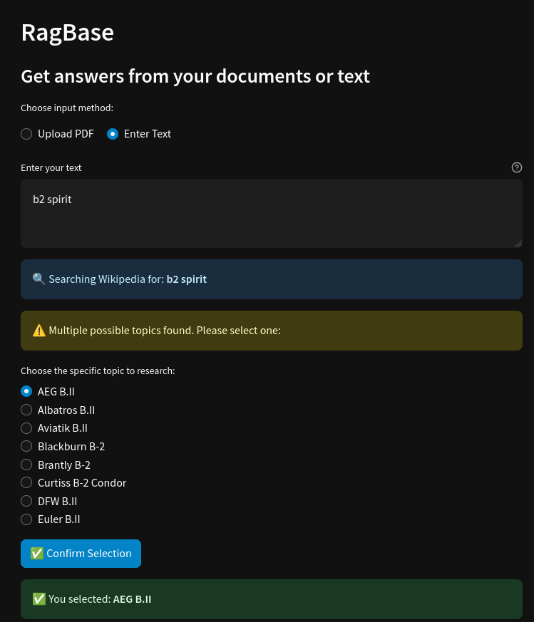
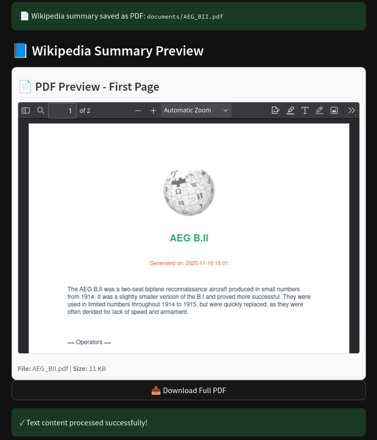

# RagBase - Private Chat with Your Documents


## New Version
> Completely local RAG with chat UI




## Demo

Check out the [RagBase on Streamlit Cloud](https://ragbase.streamlit.app/). Runs with Groq API.

## Installation

Clone the repo:

```sh
git clone git@github.com:curiousily/ragbase.git
cd ragbase
```

Install the dependencies (requires Poetry):

```sh
poetry install
```

Fetch your LLM (gemma2:9b by default):

```sh
ollama pull gemma2:9b
```

Run the Ollama server

```sh
ollama serve
```

Start RagBase:

```sh
poetry run streamlit run app.py
```

## Architecture

### Ingestor
- Extracts text from PDF documents.
- Splits text into semantic chunks.
- Stores embeddings in a vector database for semantic search.

### Retriever
- Searches for similar documents given a query.
- Re-ranks results and applies an LLM chain filter.
- Returns the most relevant passages for the question.

### QA Chain
- Combines LLM with retriever.
- Allows conversational Q&A over your documents.

### Wikipedia Search
- Summarizes user input for search queries.
- Fetches top Wikipedia results.
- Handles disambiguation and topic selection.
- Generates PDF summaries from results.

## Tech Stack

- [Ollama](https://ollama.com/) - local LLM server
- [Groq API](https://groq.com/) - optional fast inference for LLMs
- [LangChain](https://www.langchain.com/) - build LLM-powered apps
- [Qdrant](https://qdrant.tech/) - vector search/database
- [Streamlit](https://streamlit.io/) - interactive web UI
- [PDFium](https://pdfium.googlesource.com/pdfium/) - PDF processing and text extraction

## Usage

1. Upload a PDF or enter text in the app.
2. For PDFs: preview, ask questions, and get answers.
3. For text: fetch top Wikipedia summaries, handle disambiguation, and download PDFs.
4. Chat interface works with PDF uploads for interactive Q&A.

## Optional: Groq API Key

Replace local LLM with Groq API for inference. Add a `.env` file with:

```sh
GROQ_API_KEY=YOUR_API_KEY
```